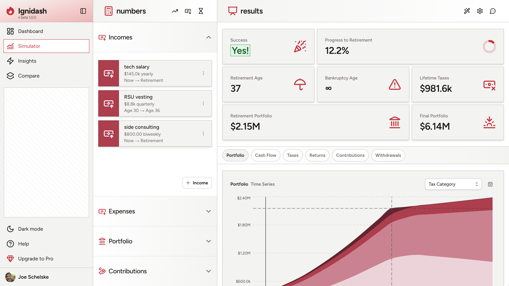
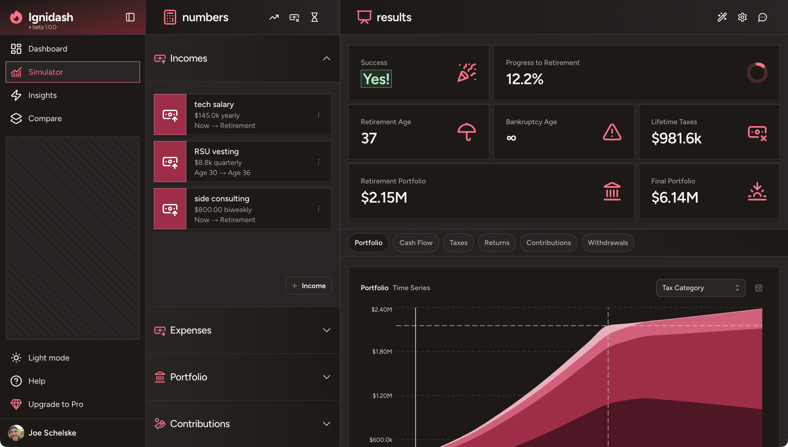

<div align="center">
  <h1>
    &nbsp;Ignidash
  </h1>
</div>

<p align="center">
  <b>An open-source personal financial planning app with AI-powered features.</b><br />
  <b>Monte Carlo simulations • Historical backtesting • US tax estimation • AI chat & insights</b>
</p>

<h3 align="center">
  <a href="https://www.ignidash.com/">Website</a> &bull;
  <a href="https://discord.gg/AVNg9JCNUr">Discord</a> &bull;
  <a href="./SELF_HOSTING.md">Self-Hosting</a>
</h3>

<h4 align="center">
  <a href="https://github.com/schelskedevco/ignidash/stargazers">
    
  </a>
  <a href="https://github.com/schelskedevco/ignidash?tab=AGPL-3.0-1-ov-file#readme">
    
  </a>
  <a href="https://github.com/schelskedevco/ignidash/blob/main/CONTRIBUTING.md">
    
  </a>
  <a href="https://discord.gg/AVNg9JCNUr">
    
  </a>
  <a href="https://x.com/schelskedevco">
    
  </a>
</h4>

---

<p align="center">
  <a href="#gh-light-mode-only">
    
  </a>
  <a href="#gh-dark-mode-only">
    
  </a>
</p>

## What is Ignidash?

Ignidash is a web-based retirement planning tool. It focuses on long-term financial projections as opposed to budgeting and day-to-day expense tracking.

**What it does:**

- **Monte Carlo & Historical Backtesting**
  Run hundreds of simulations to identify risks and calculate your probability of success. Test against actual historical market data to see how your plan would have performed.

- **US Tax Estimation**
  Model how withdrawals, asset location, and income changes impact your estimated tax liability.

- **AI Chat**
  Ask questions, clarify results, and learn about retirement planning concepts with an AI chatbot that knows your plan.

- **AI Insights**
  Generate educational overviews explaining how taxes, RMDs, Roth conversions, withdrawal strategies, and more affect your results.

- **Compare Plans** _(Coming Soon)_
  Create multiple plans and view key outcomes side-by-side to see how different choices affect your future.

## Roadmap

Ignidash is in beta and actively under development. Planned features:

**Q1 2026**

- Configurable drawdown order
- Modeling debt and physical assets
- State & local taxes, IRMAA surcharges

**Q2 2026**

- Roth conversions & SEPP
- Custom financial goals & milestones

See [Known Limitations](https://www.ignidash.com/help#:~:text=Known%20limitations) for details.

## Tech Stack

- **Frontend:** Next.js 16, React 19, TypeScript, Tailwind CSS
- **Backend:** Convex (DB & server functions)
- **Auth:** Better-Auth with Google OAuth
- **Payments:** Stripe
- **AI:** Azure OpenAI

## Self-Hosting with Docker

See [SELF_HOSTING.md](./SELF_HOSTING.md) for how to host Ignidash yourself with Docker.

## Local Development

### Prerequisites

- [Node.js 22+](https://nodejs.org/)

### Setup

```bash
git clone https://github.com/schelskedevco/ignidash.git
cd ignidash

npm install

cp .env.cloud.example .env.local
```

Generate secrets and edit `.env.local` with them:

```bash
openssl rand -base64 32  # For BETTER_AUTH_SECRET
openssl rand -base64 32  # For CONVEX_API_SECRET
```

### Optional Environment Variables

| Variable                                                        | Description                                                               |
| --------------------------------------------------------------- | ------------------------------------------------------------------------- |
| `GOOGLE_CLIENT_ID`, `GOOGLE_CLIENT_SECRET`                      | [Google Cloud Console](https://console.cloud.google.com/apis/credentials) |
| `OPENAI_API_KEY`, `OPENAI_ENDPOINT`                             | [Azure AI Foundry](https://ai.azure.com/)                                 |
| `RESEND_API_KEY`                                                | [Resend](https://resend.com/)                                             |
| `STRIPE_SECRET_KEY`, `STRIPE_WEBHOOK_SECRET`, `STRIPE_PRICE_ID` | [Stripe Dashboard](https://dashboard.stripe.com/)                         |
| `NEXT_PUBLIC_STRIPE_PUBLISHABLE_KEY`                            | [Stripe Dashboard](https://dashboard.stripe.com/)                         |
| `NEXT_PUBLIC_POSTHOG_KEY`, `NEXT_PUBLIC_POSTHOG_HOST`           | [PostHog](https://posthog.com/)                                           |

### Syncing Environment Variables

After updating `.env.local`, sync your environment variables to Convex:

```bash
npm run sync-env
```

### Running Locally

```bash
# Terminal 1: Start Convex (follow prompts to create deployment)
npm run dev:convex

# Terminal 2: Start Next.js dev server
npm run dev
```

Open http://localhost:3000 in your browser.

### Available Scripts

| Command              | Description                |
| -------------------- | -------------------------- |
| `npm run dev`        | Start Next.js dev server   |
| `npm run dev:convex` | Start Convex local backend |
| `npm run build`      | Production build           |
| `npm run lint`       | Run ESLint                 |
| `npm run lint:fix`   | Run ESLint with auto-fix   |
| `npm run typecheck`  | TypeScript type checking   |
| `npm run format`     | Format with Prettier       |
| `npm run test`       | Run Vitest tests           |

### Code Style

- ESLint and Prettier run automatically on commit via Husky
- Run `npm run format` to format all files
- Run `npm run lint:fix` to auto-fix linting issues

## Contributing

- **Bug reports & feature requests:** [GitHub Issues](https://github.com/schelskedevco/ignidash/issues)
- **Questions & discussion:** [Discord](https://discord.gg/AVNg9JCNUr)
- **Pull requests:** Fork the repo, make your changes, and submit a PR

## License

[AGPL-3.0](https://github.com/schelskedevco/ignidash/blob/main/LICENSE)
